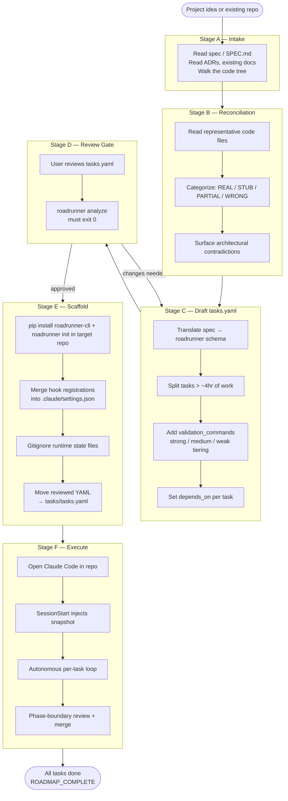
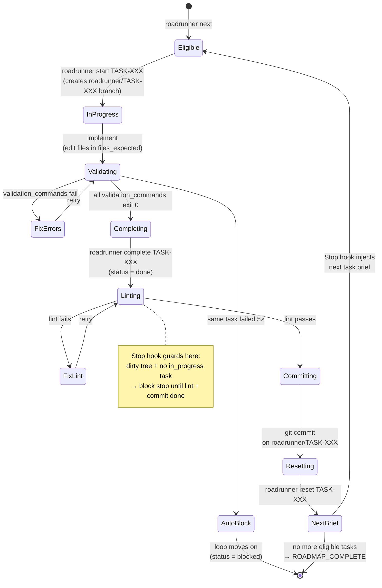
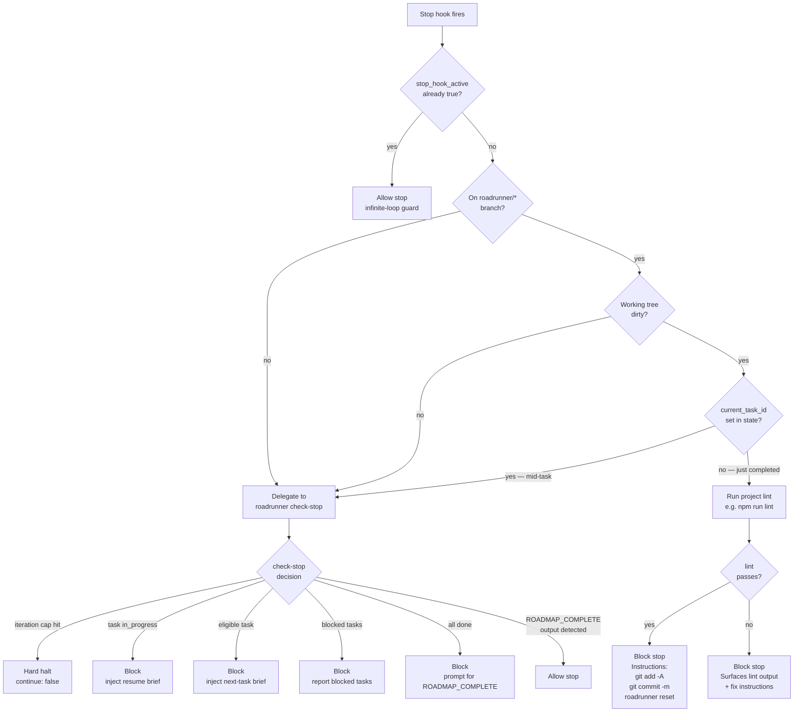
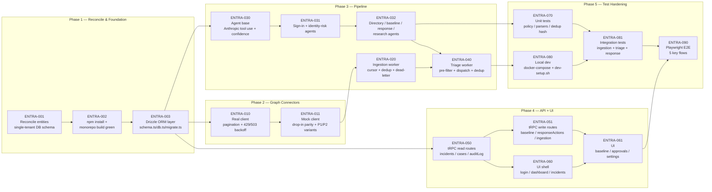

# Roadrunner Workflow

How the tool works end-to-end — for operators bringing a new project to the loop and for agents executing inside it.

---

## 1. The Five Stages, End-to-End

Roadrunner drives a project through five stages. The first four are human-led setup; the fifth is the autonomous loop.

**Stage B was the gap** before the entra-triage pilot surfaced it. Spec-shaped plans assume greenfield; real repos have partial implementations that contradict the spec. Stage B catches that before the loop burns iterations on false premises.

---

## 2. Per-Task Cycle

What happens inside a single task. This is the loop's atomic unit.

The Stop hook enforces two invariants:
1. **Validation-as-gate.** The agent can't claim a task is done until `roadrunner validate` exits 0.
2. **Commit discipline.** The agent can't move to the next task with uncommitted work on a `roadrunner/*` branch — lint runs first; if it passes, commit; if it fails, fix lint first.

---

## 3. Stop Hook Decision Tree

The Stop hook fires after every Claude turn. Its job: decide whether the agent can stop, or must keep working.

The decision order matters: the commit gate runs **before** `check-stop` delegation, so a dirty tree never proceeds to the next task. The Python `check-stop` command owns all loop-state logic; the bash wrapper only enforces the commit gate.

---

## 4. Worked Example — entra-triage Task DAG

The 18-task dependency graph for the first external pilot. Critical path is 10 tasks deep (ENTRA-001 → 002 → 003 → 010 → 011 → 020 → 040 → 080 → 081 → 090).

### Task phases at a glance

| Phase | Tasks | Why this grouping |
|---|---|---|
| **1. Reconcile & Foundation** | ENTRA-001, 002, 003 | Fix the spec/reality mismatch, install deps, add the DB layer. Nothing else can move until this is done. |
| **2. Graph Connectors** | ENTRA-010, 011 | Pagination, backoff, typed returns, mock parity. The data-source boundary. |
| **3. Pipeline** | ENTRA-020, 030, 031, 032, 040 | Ingestion → agents → triage. Where LLM cost and quality get shaped. |
| **4. API + UI** | ENTRA-050, 051, 060, 061 | tRPC routes first, then the pages that consume them. |
| **5. Test Hardening** | ENTRA-070, 080, 081, 090 | Unit + integration + E2E, plus the local-dev one-shot script. |

### Per-task breakdown

| ID | Phase | Scope | Validation tier |
|---|---|---|---|
| ENTRA-001 | 1 | Delete `tenant.ts` + `connector.ts`; strip `tenantId` from 12 entity files; fix `db/seed.sql` | Strong (grep + build) |
| ENTRA-002 | 1 | `npm install` + `npm run build` green across workspaces | Strong |
| ENTRA-003 | 1 | Create `packages/shared/src/db/{schema,db,migrate}.ts` | Medium + strong |
| ENTRA-010 | 2 | Graph client pagination, 429/503 backoff, typed Zod returns | Medium + strong |
| ENTRA-011 | 2 | Mock client drop-in parity; P1/P2 variants for ID Protection | Medium + strong |
| ENTRA-020 | 3 | Ingestion worker: checkpoint, dedup, dead-letter, pino redaction | Medium + strong |
| ENTRA-030 | 3 | `BaseAgent` refactor to Anthropic tool use + confidence scores | Medium + strong |
| ENTRA-031 | 3 | SignInTriage + IdentityRisk agents on new base | Medium + strong |
| ENTRA-032 | 3 | DirectoryChange + BaselineReview + ResponsePolicy + Research agents | Medium + strong |
| ENTRA-040 | 3 | Triage worker: pre-filter PASS/FLAG/AMBIGUOUS, dispatch, dedup, audit | Medium + strong |
| ENTRA-050 | 4 | tRPC read routes: `incidents`, `cases`, `auditLog` + JWT middleware | Medium + strong |
| ENTRA-051 | 4 | tRPC action routes: `baseline`, `responseActions`, `ingestion` — **no `execute` procedure per ADR 0006** | Medium + strong |
| ENTRA-060 | 4 | UI: login, dashboard layout, incidents page | Weak + strong |
| ENTRA-061 | 4 | UI: baseline, approvals (no Execute button per ADR 0006), settings | Weak + strong |
| ENTRA-070 | 5 | Vitest unit tests: policy engine + parsers + dedup hash | Strong |
| ENTRA-080 | 5 | `docker-compose.yml` + `scripts/dev-setup.sh` | Strong |
| ENTRA-081 | 5 | Integration tests (live Postgres) for ingestion, triage, response-action lifecycle | Strong |
| ENTRA-090 | 5 | Playwright E2E for 5 flows | Strong |

---

## 5. Operator Cheat Sheet

| Task | Command |
|---|---|
| Check queue | `roadrunner status` |
| Next eligible | `roadrunner next` |
| Validate a tasks.yaml | `roadrunner analyze [--tasks-file PATH]` |
| Scaffold a new project | `roadrunner init <dir> [--dry-run]` |
| Health snapshot | `roadrunner health` |
| Unblock a task | Edit `status` back to `todo` in `tasks/tasks.yaml`, then `roadrunner status` |

## 6. Related Docs

- [CLAUDE.md](../CLAUDE.md) — operating contract the agent follows
- [DESIGN.md](../DESIGN.md) — architectural rationale
- [docs/adr/](./adr/) — accepted decisions (ADR-001 through ADR-010)
